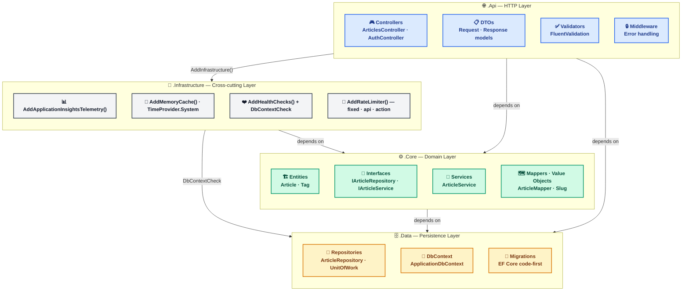
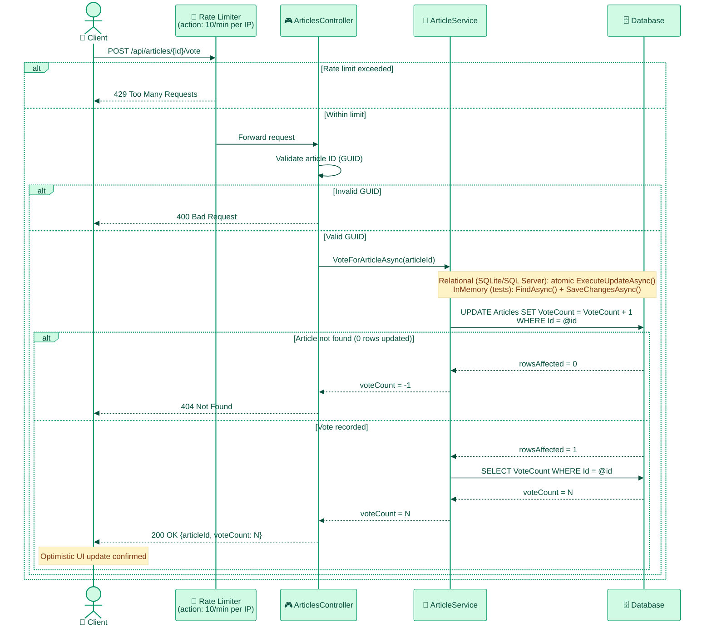
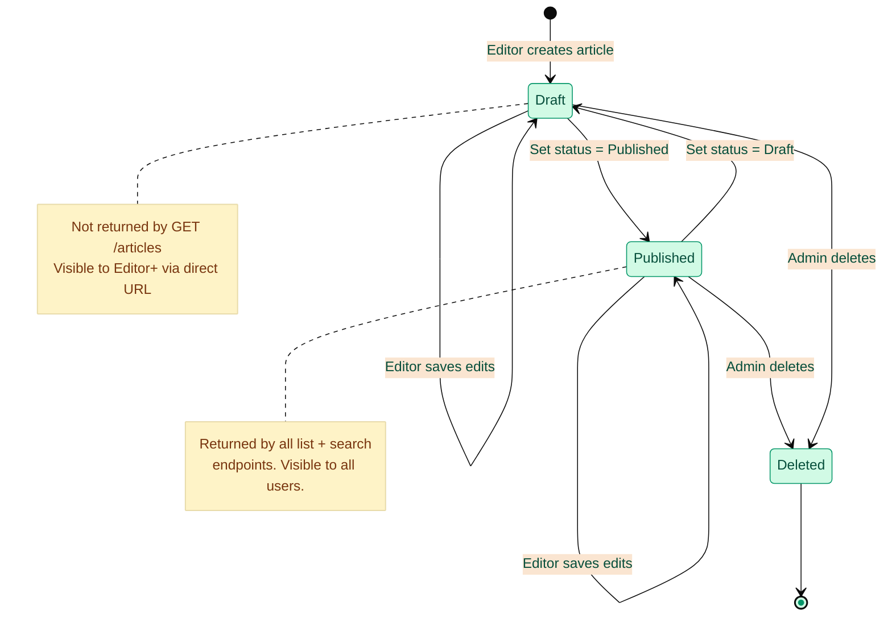
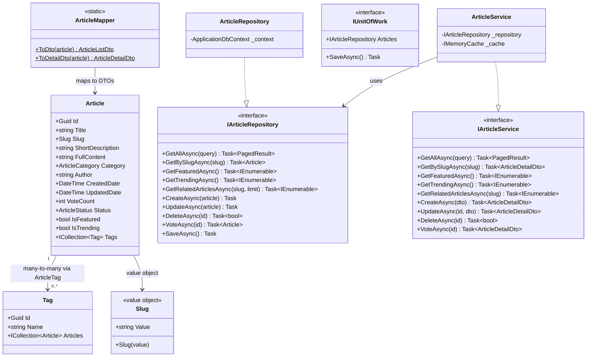

# Backend Architecture

**Last Updated:** 2026-03-24
**Audience:** Backend Developers, Solutions Architects
**Purpose:** Describe the ASP.NET Core 8 backend structure, Clean Architecture layers, patterns used, and links to the full API reference.

---

## 1. Clean Architecture Layers

```
Accelerator.Api            ← HTTP layer: Controllers, DTOs, Middleware, Validators, Filters
        ↓ depends on
Accelerator.Infrastructure ← Cross-cutting: AppInsights, Caching, HealthChecks, RateLimiter
        ↓ depends on
Accelerator.Core           ← Domain layer: Entities, Services, Interfaces, Enums, Value Objects
Accelerator.Data           ← Persistence layer: Repositories, DbContext, Migrations
```

**Dependency rule:** Outer layers depend on inner layers. No reverse dependencies. `Api` also directly references `Core` and `Data` for composition-root decisions (DbContext config, CORS, Auth) that stay in `Program.cs`.



---

## 2. Key Patterns & Components

### Repository Pattern
- Interface defined in `Core`: `IArticleRepository`
- Implementation in `Data`: `ArticleRepository`
- `GetRelatedArticlesAsync(slug, limit=3)` — category-first + tag-overlap + vote-sorted, `AsNoTracking`

### Unit of Work
- `IUnitOfWork` registered as scoped service in DI
- `ArticleService` calls `repository.SaveAsync()` directly

### ArticleMapper
- Dedicated mapper class (not AutoMapper) in `Core`
- `ToDto`: `Article` → `ArticleListDto` (excludes `FullContent` for list queries)
- `ToDetailDto`: `Article` → `ArticleDetailDto` (includes tags, full content)
- **Category mapping:** Backend enum `General` → frontend string `"General"` (see [DATA_MODEL.md](DATA_MODEL.md))

### Value Objects
- `Slug`: immutable value object with `GeneratedRegex` validation (lowercase alphanumeric + hyphens)

### Memory Caching
- `IMemoryCache` for featured, trending, and related articles
- Cache keys: `featured_articles`, `trending_articles`, `related_articles_{slug}`
- TTL: 5 minutes; `VoteForArticleAsync` invalidates `featured_articles` + `trending_articles`
- Cache hit/miss emitted as `FeaturedArticlesCacheHit` / `TrendingArticlesCacheHit` metrics via `TelemetryClient`

### Business Telemetry
- `TelemetryClient` injected into `ArticleService`
- Events: `ArticleViewed` (slug, category), `ArticleVoted` (articleId), `ArticleSearched` (search, category, tagCount), `ArticleCreated` (slug, category), `ArticleUpdated` (slug, category)
- Metrics: `FeaturedArticlesCacheHit`, `TrendingArticlesCacheHit` (1 = hit, 0 = miss)

### Rate Limiting (Fixed Window)
| Policy | Limit | Window |
|--------|-------|--------|
| `fixed` | 100 req/min | Per IP |
| `api` | 50 req/min | Per IP |
| `action` | 10 req/min | Per IP |

### TimeProvider
- `TimeProvider.System` injected via DI for testable time operations

---

## 3. API Reference

> Full API reference has moved to **[`documentation/api/`](../api/API_REFERENCE_INDEX.md)** — includes DTOs, validation rules, request/response examples, and query parameter details.

Quick links:
- [API Reference Index](../api/API_REFERENCE_INDEX.md) — base URLs, versioning, auth, rate limiting, error shapes
- [Articles API](../api/ARTICLES_API.md) — all `/articles` endpoints with full DTO tables and examples
- [Auth API](../api/AUTH_API.md) — `/auth/me`
- [Health API](../api/HEALTH_API.md) — `/health`, `/health/ready`

---

## 3a. Article Vote Flow



---

## 4. Data Validation

- `FluentValidation` applied to all DTOs: `CreateArticleDto`, `UpdateArticleDto`, `GetArticlesQuery`
- All text fields have `MaxLength` constraints
- Tags must not be empty or contain only whitespace
- Category validated via `Enum.TryParse` in FluentValidation; controller uses `Enum.Parse` (safe — FluentValidation runs first)
- Automatic model validation via `AddValidatorsFromAssembly` + `AddFluentValidationAutoValidation`

---

## 5. Error Handling

- Global error handling middleware (`ExceptionHandlingMiddleware`): returns consistent JSON error responses
- `OperationCanceledException` from client disconnects caught separately, logged at `Information` (not `Error`) to reduce noise
- Other exceptions logged at `Error` level with full details (server-side only — not exposed to clients)
- No exception details leaked to clients in production

---

## 6. Performance Optimizations

- **EF Core projections:** `Select()` excludes `FullContent` from list queries (only fetched on detail)
- **Atomic SQL updates:** `ExecuteUpdateAsync()` for vote operations to prevent race conditions
- **Memory caching:** Featured, trending, and related articles cached for 5 minutes
- **Efficient indexing:** Database indexed on slug, category, and tags
- **Pagination:** All list endpoints paginate to limit data transfer
- **`AsNoTracking()`** on all read-only queries

---

## 6a. Article Lifecycle



---

## 7. Project Structure

```
backend/
├── src/
│   ├── Accelerator.Api/
│   │   ├── Controllers/
│   │   │   ├── ArticlesController.cs
│   │   │   └── AuthController.cs
│   │   ├── DTOs/
│   │   ├── Middleware/
│   │   ├── Validators/
│   │   ├── Filters/
│   │   └── Program.cs
│   ├── Accelerator.Core/
│   │   ├── Entities/          ← Article, Tag
│   │   ├── Enums/             ← ArticleCategory, ArticleStatus
│   │   ├── Interfaces/        ← IArticleRepository, IArticleService, IUnitOfWork
│   │   ├── Services/          ← ArticleService
│   │   ├── Mappers/           ← ArticleMapper
│   │   └── ValueObjects/      ← Slug
│   └── Accelerator.Data/
│       ├── Repositories/      ← ArticleRepository, UnitOfWork
│       ├── Migrations/
│       └── ApplicationDbContext.cs
└── tests/
    ├── Accelerator.Core.Tests/
    ├── Accelerator.Data.Tests/
    └── Accelerator.Api.Tests/   ← includes integration tests
```

---

## 7a. Backend Domain Model



---

## 8. Testing

- **Framework:** xUnit + Moq + FluentAssertions
- **Repository tests:** EF Core InMemory provider
- **Integration tests:** `WebApplicationFactory` with `TestAuthHandler` (header-driven auth via `X-Test-Roles`)
- **Current count:** 109 tests passing
- **Coverage:** ~85% on testable code

See [../testing/TESTING_STRATEGY.md](../testing/TESTING_STRATEGY.md) for full testing approach.

---

## 9. Configuration

```bash
# Backend environment variables
ConnectionStrings__DefaultConnection=   # Empty/unset = SQLite (local dev); non-empty = SQL Server (production)
FrontendUrl=http://localhost:3000        # Single CORS origin (legacy); production uses FrontendUrls array
FrontendUrls__0=https://example.com     # Multiple CORS origins (current); localhost:3000 auto-added in Development only
Authentication__Authority=              # OIDC authority (optional; auth disabled if not set)
Authentication__Audience=               # API app client ID
Authentication__RequireHttpsMetadata=true
```

See [../../deployment/github-secrets-setup.md](../../deployment/github-secrets-setup.md) for production secrets configuration.
