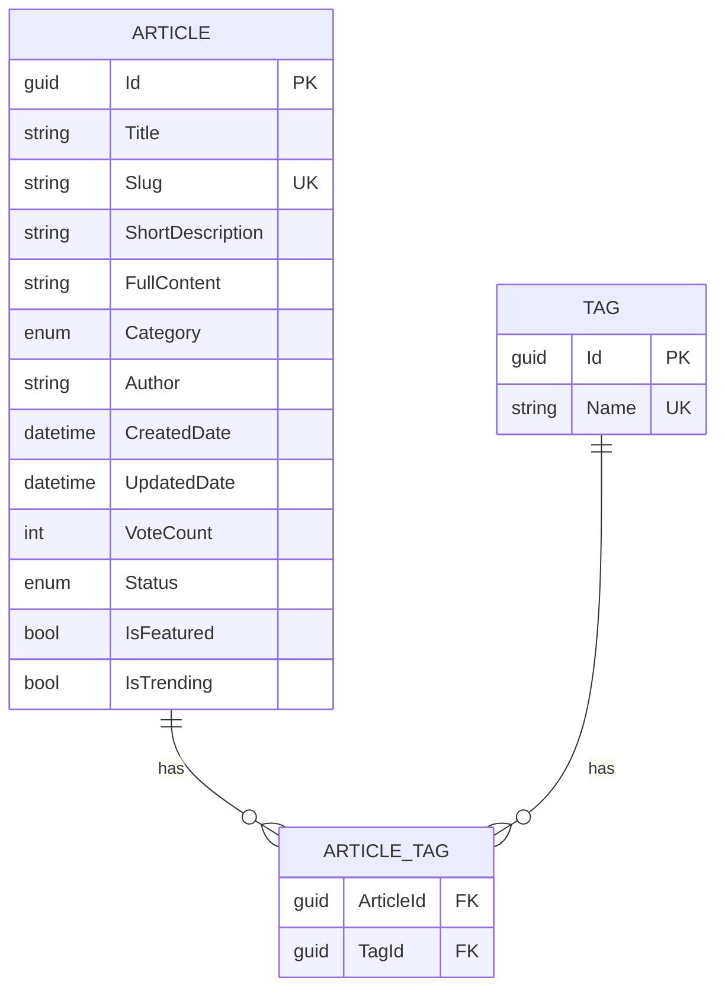

# Data Model

**Last Updated:** 2026-03-24
**Audience:** Backend Developers, Solutions Architects
**Purpose:** Define the database entities, relationships, seeding data, and the critical category enum mapping convention.

---

## 1. Entities

### Article

The core domain entity. Rename to your domain via `scripts/rename-entity.sh`.

| Field | Type | Constraints | Notes |
|-------|------|-------------|-------|
| `Id` | GUID | Primary Key | |
| `Title` | string | Required, MaxLength 255 | |
| `Slug` | string | Required, Unique, indexed | Value Object with `GeneratedRegex` validation |
| `ShortDescription` | string | MaxLength 500 | Used in list cards |
| `FullContent` | string | — | Markdown; excluded from list queries via EF projection |
| `Category` | ArticleCategory (enum) | Required, indexed | |
| `Author` | string | Optional, MaxLength 100 | |
| `CreatedDate` | DateTime | — | Set via TimeProvider |
| `UpdatedDate` | DateTime | — | Set via TimeProvider |
| `VoteCount` | int | — | Updated atomically via `ExecuteUpdateAsync` |
| `Status` | ArticleStatus (enum) | — | Draft or Published |
| `IsFeatured` | bool | — | Drives featured query |
| `IsTrending` | bool | — | Drives trending query |
| `Tags` | ICollection\<Tag\> | Many-to-many | Via `ArticleTag` junction table |

### Tag

| Field | Type | Constraints |
|-------|------|-------------|
| `Id` | GUID | Primary Key |
| `Name` | string | Required, indexed |
| `Articles` | ICollection\<Article\> | Many-to-many |

### Junction Table: ArticleTag

Many-to-many relationship between `Article` and `Tag`. EF Core handles this automatically via the navigation properties.

---

## 2. Enums

### ArticleCategory (Backend)

The accelerator ships with these example categories. Replace them via `scripts/rename-entity.sh` or by editing the enum directly.

| Backend Enum Value | Frontend Display String |
|--------------------|------------------------|
| `General` | `"General"` |
| `Tutorial` | `"Tutorial"` |
| `Guide` | `"Guide"` |
| `Reference` | `"Reference"` |
| `News` | `"News"` |

**Critical:** The backend serializes enums as camelCase JSON. The frontend must always use `lib/api/mappers.ts` to convert between backend and frontend values. Never hardcode the string representations.

### ArticleStatus

| Value | Meaning |
|-------|---------|
| `Draft` | Not publicly visible |
| `Published` | Publicly visible |

---

## 3. Database Configuration

- **Development:** SQLite at `backend/src/Accelerator.Api/accelerator.db`
- **Production:** Azure SQL Server (applied via EF Core migrations — **not** auto-applied on startup in production)
- **Migrations:** Code-first, stored in `Accelerator.Data/Migrations/`

Indexes defined on:
- `Article.Slug` (unique)
- `Article.Category`
- `Tag.Name`
- The junction table composite key

---

## 4. Seed Data

Seed data is applied during development database creation (`dotnet ef database update`).

- **6 seed articles** with IDs `b0000000-0000-0000-0000-000000000001` through `...000006`
- **18 seed tags** with IDs `a0000000-0000-0000-0000-000000000001` through `...000018`
- Many-to-many relationships seeded via junction table inserts

Seed content is defined in `backend/src/Accelerator.Data/ApplicationDbContext.cs`.

---

## 5. Entity Relationship Diagram



---

## 6. EF Core Patterns

- **Projections:** `Select()` used on list queries to exclude `FullContent` (large field not needed in cards)
- **`AsNoTracking()`:** Applied to all read-only queries
- **Atomic updates:** Vote count updated with `ExecuteUpdateAsync()` to avoid race conditions
- **Includes:** `Include(a => a.Tags)` applied when tags are needed

---

## 7. Migration Commands

```bash
# From repo root
dotnet ef database update \
  --project backend/src/Accelerator.Data \
  --startup-project backend/src/Accelerator.Api

# Add a new migration
dotnet ef migrations add MigrationName \
  --project backend/src/Accelerator.Data \
  --startup-project backend/src/Accelerator.Api
```

See [../../deployment/database-migration.md](../../deployment/database-migration.md) for production migration procedures.
