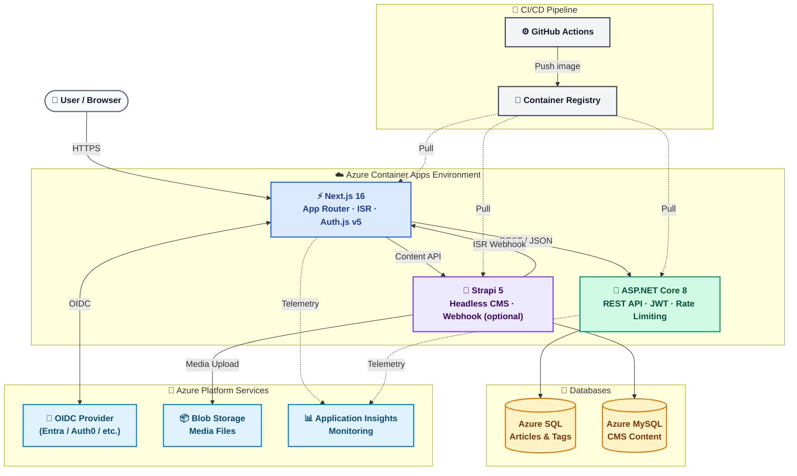

# System Overview

**Last Updated:** 2026-03-24
**Audience:** Solutions Architect, all developers, new contributors
**Purpose:** High-level overview of the AI Fullstack Accelerator system — what it is, what it does, and how its major components interact.

---

## 1. Vision

The AI Fullstack Accelerator is a production-ready full-stack blueprint that developers can clone, rename their domain entity, and ship.

Each "Article" in the accelerator represents an example CRUD entity demonstrating every operation type — list, detail, create, update, delete, vote, search, and filter. Users rename it to their domain entity (Product, Order, Recipe, etc.) via `scripts/rename-entity.sh`.

The platform demonstrates enterprise-grade development practices (Clean Architecture, SOLID, DRY) and is designed for extensibility:

- Provider-agnostic authentication (any OIDC: Entra, Auth0, Cognito, Okta, Keycloak)
- Optional headless CMS (Strapi 5 — isolated behind Docker profile, easy to remove)
- Azure-native IaC with Bicep (swap to Terraform for other clouds)
- Comprehensive testing: unit, integration, E2E, visual regression, performance, accessibility

---

## 2. Technology Stack

### Frontend

| Technology | Purpose |
|-----------|---------|
| Next.js 16 (App Router, React 19) | Server-side rendering, routing, ISR |
| TypeScript | Type safety throughout |
| Tailwind CSS | Utility-first styling |
| shadcn/ui | Component primitives |
| Auth.js v5 (NextAuth) | Authentication (OIDC provider-agnostic) |
| react-markdown + rehype-sanitize | Safe markdown rendering |
| Sonner | Toast notifications |
| Lucide | Icon library |
| next/image | Optimized image loading |

### Backend

| Technology | Purpose |
|-----------|---------|
| ASP.NET Core 8 (Web API) | RESTful API server |
| C# 12 | Implementation language |
| Entity Framework Core 8 | ORM with code-first migrations |
| FluentValidation | DTO and query validation |
| xUnit + Moq | Testing framework |

### Infrastructure & Platform

| Technology | Purpose |
|-----------|---------|
| Azure Container Apps | Primary hosting (scale-to-zero) |
| Azure SQL | Production database |
| Azure Container Registry | Docker image storage |
| Azure Application Insights | Monitoring and telemetry |
| Azure Key Vault | Secrets management |
| Azure Blob Storage | CMS media files |
| GitHub Actions | CI/CD pipelines |

### CMS (Optional)

| Technology | Purpose |
|-----------|---------|
| Strapi 5 | Headless CMS for all static site content |
| MySQL (Azure Flexible Server) | Strapi production database |
| Docker Compose | Local CMS development (opt-in via `--profile cms`) |

### Development Environment

| Environment | Database | API |
|------------|---------|-----|
| Development | SQLite | http://localhost:5255 |
| Production | Azure SQL | Azure Container Apps URL |

---

## 3. Architecture Components

The system has three distinct application tiers and a shared infrastructure layer:

```
Browser
  │
  ▼
Next.js Frontend (Azure Container App)
  │  - Server Components for ISR/SSR
  │  - Client Components for interactive UI
  │  - Auth.js for session management
  │
  ├──► ASP.NET Core API (Azure Container App)
  │      - RESTful endpoints
  │      - JWT validation via OIDC discovery
  │      - Rate limiting, caching, validation
  │      └──► Azure SQL Database
  │
  └──► Strapi CMS (Azure Container App) [optional]
         - Static content management
         - On-demand ISR revalidation webhook
         └──► Azure MySQL Database
```



---

## 4. Development URLs

| Service | URL |
|---------|-----|
| Frontend | http://localhost:3000 |
| Backend API | http://localhost:5255 |
| Strapi CMS (optional) | http://localhost:1337 |
| Swagger (dev only) | http://localhost:5255/swagger |

Production URLs are determined by your Azure Container Apps deployment (configured via `infrastructure/main.parameters.prod.json`).

---

## 5. Key Architectural Decisions

The most significant architectural choices are recorded in `documentation/decisions/TECHNICAL_DECISIONS_LOG.md`. Notable patterns:

- **Authentication:** Auth.js v5 + any OIDC provider — provider-agnostic by design
- **CMS:** Strapi 5 optional headless CMS — isolated behind Docker `--profile cms`
- **Deployment:** Azure Container Apps (scale-to-zero, low-cost)
- **Entity example:** Article — rename via `scripts/rename-entity.sh`
- **API design:** RESTful with versioning, rate limiting, caching, pagination
- **Security:** JWT sessions, CORS, CSP, rate limiting, non-root containers

---

## 6. Further Reading

| Topic | Document |
|-------|---------|
| Backend layer details, API reference, data model | [BACKEND_ARCHITECTURE.md](BACKEND_ARCHITECTURE.md) |
| Frontend App Router, auth flow, component structure | [FRONTEND_ARCHITECTURE.md](FRONTEND_ARCHITECTURE.md) |
| Strapi CMS content model, webhooks, gotchas | [CMS_ARCHITECTURE.md](CMS_ARCHITECTURE.md) |
| Entity model, seeding, enum mapping | [DATA_MODEL.md](DATA_MODEL.md) |
| Auth, CORS, CSP, rate limiting, security headers | [SECURITY_OVERVIEW.md](SECURITY_OVERVIEW.md) |
| Bicep IaC, resource inventory, deploy workflow | [../operations/INFRASTRUCTURE_MANAGEMENT.md](../operations/INFRASTRUCTURE_MANAGEMENT.md) |
| Azure deployment guide | [../../deployment/README.md](../../deployment/README.md) |
