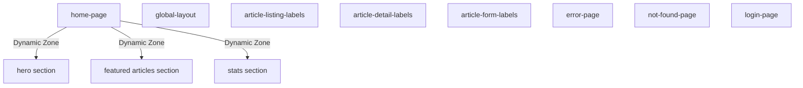

# CMS Component Index

**Last Updated:** 2026-03-24
**Audience:** Frontend Developers, Content Editors
**Purpose:** Master index of all Strapi 5 CMS component schemas used in the accelerator — field tables, dependency map, and reuse guide.

> **Status:** Placeholder — populate this index when you have seeded your Strapi instance and finalized your content model.

---

## How to Use This Index

Each content type and component in your Strapi instance should be documented here with:
1. **Purpose** — what page/section it drives
2. **Field table** — name, type, required, notes
3. **Dependencies** — which components does it nest or reference

---

## Content Types

The accelerator ships with these Strapi content types (configured in `cms/src/api/`):

| Content Type | Purpose |
|-------------|---------|
| `home-page` | Home page Dynamic Zone (hero, featured articles, stats) |
| `global-layout` | Navigation, footer, site-wide labels |
| `about-page` | About page Dynamic Zone |
| `docs-page` | Documentation page Dynamic Zone |
| `login-page` | Login page labels |
| `error-page` | Error page content with fallback text |
| `not-found-page` | 404 page content |
| `article-listing-labels` | Labels for SearchBar, FilterPanel, SortSelector, EmptyState, Pagination |
| `article-detail-labels` | Labels for article detail sub-components |
| `article-form-labels` | Labels for ArticleForm create/edit |

---

## Components (Shared)

Components live in `cms/src/components/` and are reused across content types via Dynamic Zones.

Document your components here as you build them out. See [CMS_ARCHITECTURE.md](../architecture/CMS_ARCHITECTURE.md) for the full CMS architecture reference.

---

## Component Dependency Map

---

## Adding a New Component

1. Create the component schema in Strapi admin (`Settings → Components`)
2. Add it to the relevant content type Dynamic Zone
3. Create a TypeScript type in `lib/cms/types.ts`
4. Add a renderer in `lib/cms/components.tsx`
5. Document the field table in this index
6. Update the dependency map above

See [GOVERNANCE.md](../GOVERNANCE.md) for documentation conventions.
